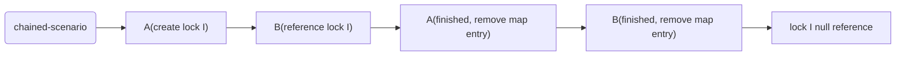

# Reference-Chain Lock Pattern
This pattern utilizes reference chaining between concurrent threads, where multiple threads share
the same ReentrantLock object through references. When the last thread releases its reference,
the lock object becomes eligible for garbage collection automatically, eliminating the need for
explicit cleanup scheduling or memory management.

## Explain
